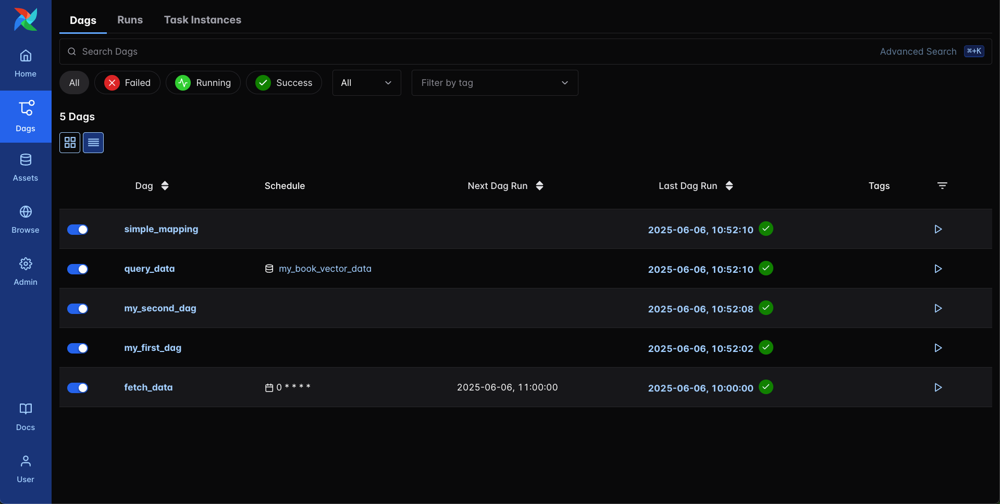
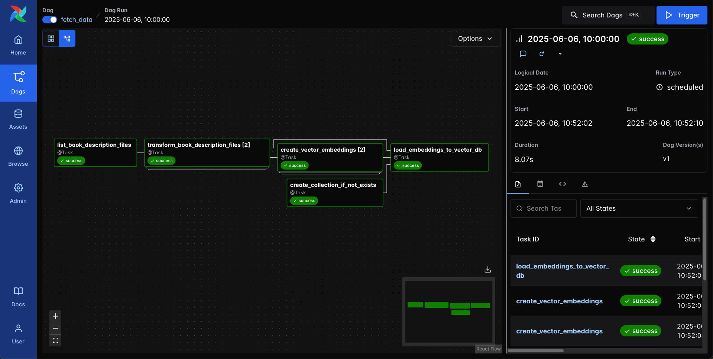

## Orchestrating Workflows for GenAI Applications

Welcome! This repository is the companion to the Orchestrating Workflows for GenAI Applications course on [Deeplearning.AI](https://www.deeplearning.ai/). It contains all the Airflow 3 dags your build throughout the course and can be run locally using the [Astro CLI](https://www.astronomer.io/docs/astro/cli/install-cli).



### Getting Started

Follow these steps to get spin up to run Airflow and Weaviate locally:

1. **Fork and clone this repository**: Click the "Fork" button on the top right of this page to create a copy of this repository in your GitHub account. Then clone it to your local machine and enter its directory:

    ```bash
    git clone <your-forked-repo-url>
    cd <your-forked-repo-name>
    ``` 

2. **Install the Astro CLI**: Follow the [installation instructions](https://www.astronomer.io/docs/astro/cli/install-cli/) to install the Astro CLI on your local machine. If you are on a mac you can install using [Homebrew](https://brew.sh/):

    ```bash
    brew install astro
    ```

    If you already have the Astro CLI installed, make sure you are at least on version **1.34.1** by running:

    ```bash
    astro --version
    ```

3. **Create a .env file**: Create a `.env` file in the root of your project directory. Copy the contents of the `.env.example` file into your new `.env` file. This file contains the environment variable Airflow uses to connect to Weaviate. If you'd like to connect to your own, cloud-hosted Weaviate instance you can provide your own connection details here. Note that you have the option to enter an OpenAI API key, but this is not required for the course pipelines to run.

4. **Start the project** by running the following command:

    ```bash
    astro dev start
    ```

    After running this command, the Astro CLI will start 5 containers running Airflow components (Scheduler, API Server, Triggerer, Dag Processor and the Postgres Metadata Database) either using Docker, if available on your machine, or using Podman, which the Astro CLI sets up for you. Alongside these containers, a local Weaviate instance, defined in the `docker-compose.override.yml` file also starts. Once Airflow is ready it will open the Airflow UI in your browser at `http://localhost:8080/`. You do not need any credentials to log in.

    Note: If you already have port `8080` or port `5432` allocated, you can either [stop your existing containers or change the port](https://www.astronomer.io/docs/astro/cli/troubleshoot-locally#ports-are-not-available-for-my-local-airflow-webserver).

5. **Access the Airflow UI**: Open your web browser and navigate to `http://localhost:8080/`. You should see the Airflow UI where you can view and manage your dags.
6. **Run the example dags**: In the Airflow UI, click on the "Dags" button to see the dag list. Unpause the `query_data` and `fetch_data` dag to run the example.
7. **Experiment!**: Modify the dags in the `dags` folder to add your own tasks, change the existing ones, or create new dags. You can also add new files to the `include` folder and reference them in your dags.
8. **Deploy your dags to Astronomer**: You can start a [free trial](https://www.astronomer.io/lp/signup/?utm_source=deeplearning-ai&utm_medium=content&utm_campaign=genai-course-6-25) and follow the sign up flow to create your first deployment. Once you have a deployment, you can push your code to Astronomer by running:

    ```bash
    astro login
    astro deploy
    ```

    For other deployment options, refer to the [Astronomer documentation](https://www.astronomer.io/docs/astro/deploy-code/).

### Repo Contents

This repository contains the following files and folders:

- `.astro`: This folder contains advanced configuration files. You don't need to change anything here.
- dags: This folder contains the Python files for your Airflow dags. By default, this directory includes one example dag:
    - genai_dags
        - `fetch_data.py`: This dag extracts book descriptions from the files stored in the `include/data` folder, creates vector embeddings for them using `fastembed` and stores those embeddings in Weaviate. It also creates a Weaviate class called `Book` to store the book descriptions, if it does not already exist.

        

        - `query_data.py`: This dag queries the Weaviate instance for book descriptions based on a user-provided query. It uses the `fastembed` package to create an embedding for the query and retrieves the most similar book descriptions from Weaviate.

    - practice_dags
        - `my_first_dag.py`: A very simple dag consisting of 3 tasks.
        - `my_second_dag.py`: A slightly more complex dag consisting of 4 tasks.
        - `simple_dynamic_task_mapping.py`: A simple dag that shows how to use [dynamic task mapping](https://www.astronomer.io/docs/learn/dynamic-tasks/).

    - `.airflowignore`: This file specifies which files and folders should be ignored by Airflow when scanning for dags. You can add any files or folders you want to ignore here.
    
- include: This folder contains any additional files that you want to include as part of your project.
     - data: This folder contains book description files. You can add your own descriptions either in the existing files or in a new file if you want to query your own favorite books. Make sure to follow the same format as the existing files: `<integer index> ::: <title> (<release year>) ::: <author> ::: <description>`.

- plugins: Add custom Airflow plugins for your project to this file.
- src/img: This folder contains images used in the readme.
- tests: This folder contains unit tests and dag validation tests for your dags. You can add your own tests here to ensure your dags work as expected. All tests can be run using the command `astro dev pytest` from the root of your project directory. Note that you can use any testing framework you like, not just pytest. Some example dag validation tests are included in the `tests/test_dag_example.py` file.

- `.dockerignore`: This file specifies which files and folders should be ignored by Docker when building the image. You can add any files or folders you want to ignore here.
- `.env.example`: This file contains the environment variable defining the connection between Airflow and Weaviate. You can copy this file to create your own `.env` file. You can add additional environment variables here if needed and retrieve them from within dags using `os.getenv()`.
- `.gitignore`: This file specifies which files and folders should be ignored by Git when committing changes. You can add any files or folders you want to ignore here.
- `docker-compose.override.yml`: This file contains the configuration for the local Weaviate instance that runs alongside Airflow. You can modify it to change the Weaviate version or add additional Weaviate configuration.
- `Dockerfile`: This file contains a versioned Astro Runtime Docker image that includes open source Airflow and some additional packages. If you want to execute other commands or overrides at runtime, specify them here.

- `packages.txt`: Install OS-level packages needed for your project by adding them to this file. 
- `README.md`: This document.
- `requirements.txt`: Install Python packages needed for your project by adding them to this file. For this project `fastembed` and the [Airflow Weaviate Provider](https://airflow.apache.org/docs/apache-airflow-providers-weaviate/stable/index.html) are included. If you'd like to use other Python packages in your task code, add them here.
- plugins: Add custom Airflow plugins for your project to this file.

### Resources

- Course: Orchestrating Workflows for GenAI Applications
- [Airflow Documentation](https://airflow.apache.org/docs/apache-airflow/stable/index.html)
- [Airflow guides and tutorials](https://www.astronomer.io/docs/learn/)
- [Astro free trial](https://www.astronomer.io/lp/signup/?utm_source=deeplearning-ai&utm_medium=content&utm_campaign=genai-course-6-25): Sign up for a free trial of Astro to deploy your dags to Astronomer.

#### Resources by lesson

- Lesson 2:
    - [Weaviate Short Course - Vector Databases: from Embeddings to Applications](https://www.deeplearning.ai/short-courses/vector-databases-embeddings-applications/)
    - [Weaviate Short Course - Building Multimodal Search and RAG](https://www.deeplearning.ai/short-courses/building-multimodal-search-and-rag/)
    - [Weaviate Documentation](https://weaviate.io/developers/weaviate)
- Lesson 3:
    - [Introduction to the TaskFlow API and Airflow decorators](https://www.astronomer.io/docs/learn/airflow-decorators/): Learn more about decorators generally in Python and specifically in Airflow.
    - [Manage task and task group dependencies in Airflow](https://www.astronomer.io/docs/learn/managing-dependencies/): Learn more about setting dependencies between tasks using the `chain` function and other methods.
    - [Airflow Operators](https://www.astronomer.io/docs/learn/what-is-an-operator): Learn more about operator classes which can be used alongside `@task` to create Airflow tasks.
- Lesson 4:
    - [Connections & Hooks in the Airflow documentation](https://airflow.apache.org/docs/apache-airflow/stable/authoring-and-scheduling/connections.html)
    - [Airflow Weaviate Provider Package](https://airflow.apache.org/docs/apache-airflow-providers-weaviate/stable/index.html): Documentation of the Airflow Weaviate Provider Package which includes the `WeaviateHook`.
    - [Airflow Hooks](https://www.astronomer.io/docs/learn/what-is-a-hook/): Learn about Airflow hooks like the `WeaviateHook`.
    - [Manage connections in Apache Airflow](https://www.astronomer.io/docs/learn/connections): Learn about the different ways to connect Airflow to other tools.
    - [Strategies for custom XCom backends in Airflow](https://www.astronomer.io/docs/learn/custom-xcom-backend-strategies/): Learn how to save data that is passed between tasks in different storage systems.
- Lesson 5:
    - [Schedule DAGs in Apache Airflow®](https://www.astronomer.io/docs/learn/scheduling-in-airflow/): Learn all the different ways of scheduling Airflow dags.
    - [DAG-level parameters in Airflow](https://www.astronomer.io/docs/learn/airflow-dag-parameters/): A comprehensive list of dag parameters in Airflow.
    - [Assets and data-aware scheduling in Airflow](https://www.astronomer.io/docs/learn/airflow-datasets/): Learn how to created advanced data-aware schedules using `Asset`s in Airflow.
    - [Access the Apache Airflow context](https://www.astronomer.io/docs/learn/airflow-context/): Learn how to interact with the Airflow context dictionary retrieved with `**context`.
    - [Create and use params in Airflow](https://www.astronomer.io/docs/learn/airflow-params/): Learn how to create advanced `params` dictionaries for your Airflow dags.
    - [Airflow REST API - Create Asset Event](https://airflow.apache.org/docs/apache-airflow/stable/stable-rest-api-ref.html#operation/create_asset_event): You can update Assets from outside of Airflow using the Airflow REST API.
- Lesson 6:
    - [Create dynamic Airflow tasks](https://www.astronomer.io/docs/learn/dynamic-tasks/): Learn all about dynamic task mapping in Airflow.
    - Tip: you can limit the number of concurrently running mapped task instances using the task-level parameters `max_active_tis_per_dag` and `max_active_tis_per_dagrun`.
    - [Airflow configuration reference - AIRFLOW__CORE__MAX_MAP_LENGTH](https://airflow.apache.org/docs/apache-airflow/stable/configurations-ref.html#max-map-length): By default you can have up to 1024 dynamically mapped instances per task. Use this configuration environment variable to modify that limit.
- Lesson 7:
    - [Airflow trigger rules](https://www.astronomer.io/docs/learn/airflow-trigger-rules/): A reference of all available trigger rules.
    - [Manage Apache Airflow® DAG notifications](https://www.astronomer.io/docs/learn/error-notifications-in-airflow/): Learn about different ways to let Airflow notify you of task and dag states, including notifier classes.
    - [Airflow Apprise provider](https://airflow.apache.org/docs/apache-airflow-providers-apprise/stable/index.html): Documentation for the Airflow Apprise provider that integrates with many notification tools.